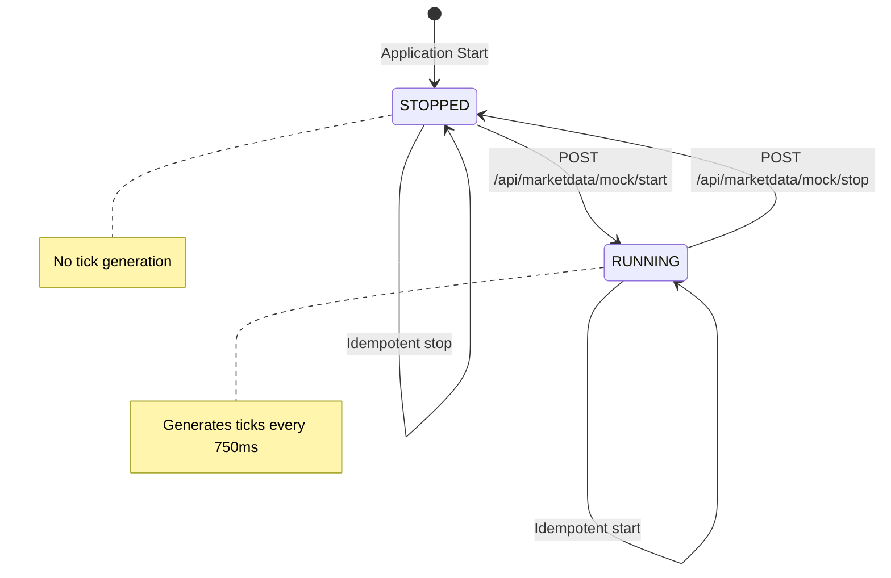
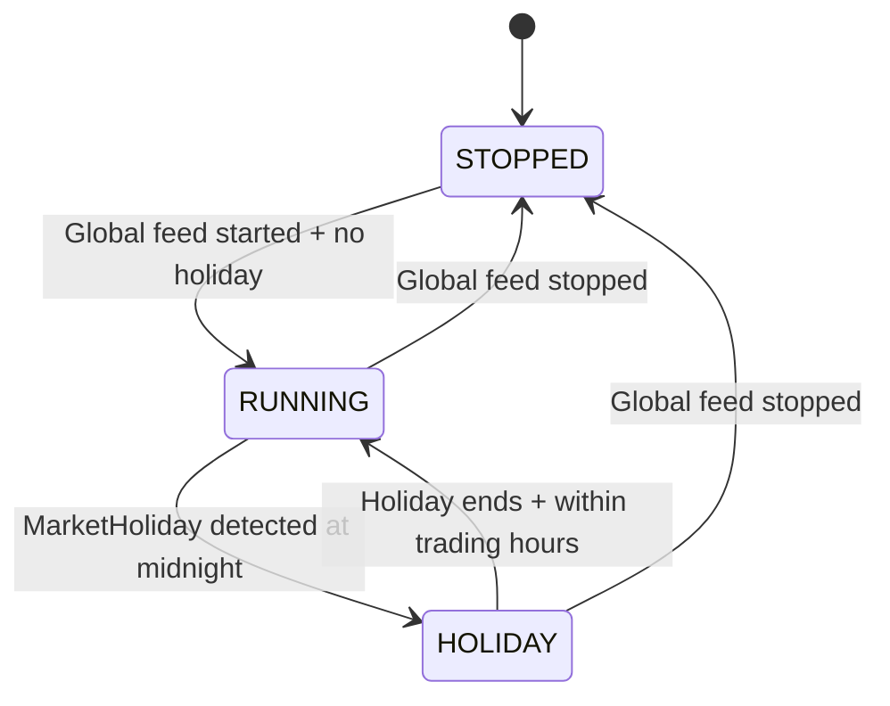

# Data Model: Mock Market Data & Market Watch

**Feature**: 002-mock-market-data  
**Date**: 2025-11-13  
**Purpose**: Define entities, DTOs, value objects, and relationships for simulated market data pipeline.

---

## Overview

This feature extends existing M0 domain entities (`Instrument`, `MarketHoliday`, `Watchlist`) with new runtime state models and data transfer objects for quote broadcasting, bar aggregation, and operator control.

**Key Design Principles**:

- **Immutability**: All DTOs are immutable (record types in Java 17+)
- **Separation of Concerns**: Domain entities (persistent) vs. State models (in-memory) vs. DTOs (wire format)
- **Type Safety**: Use enums for states (FeedState, ConnectionStatus) to prevent invalid values
- **Validation**: Apply JSR-303 annotations (@NotNull, @Positive) on DTOs for automatic validation

---

## Existing Domain Entities (from M0 Baseline)

### Instrument

**Location**: `src/main/java/com/rnexchange/domain/Instrument.java`

```java
@Entity
@Table(name = "instrument")
public class Instrument {

  @Id
  @GeneratedValue(strategy = GenerationType.SEQUENCE, generator = "sequenceGenerator")
  private Long id;

  @NotNull
  @Column(name = "symbol", unique = true)
  private String symbol; // e.g., "RELIANCE", "GOLD_FUT_DEC25"

  @NotNull
  @Column(name = "name")
  private String name; // e.g., "Reliance Industries Ltd."

  @NotNull
  @Enumerated(EnumType.STRING)
  @Column(name = "asset_class")
  private AssetClass assetClass; // EQUITY, COMMODITY, DERIVATIVE

  @ManyToOne(optional = false)
  @JoinColumn(name = "exchange_id")
  private Exchange exchange; // NSE, BSE, MCX

  @Column(name = "tick_size", precision = 10, scale = 4)
  private BigDecimal tickSize; // e.g., 0.05 for most equities

  @Column(name = "lot_size")
  private Integer lotSize; // e.g., 1 for equities, 100 for futures

  @Column(name = "is_active")
  private Boolean isActive; // Only active instruments get mock ticks
  // ... getters/setters
}

```

**Usage in Feature**: Loaded at feed start to populate `InstrumentState` map.

---

### MarketHoliday

**Location**: `src/main/java/com/rnexchange/domain/MarketHoliday.java`

```java
@Entity
@Table(name = "market_holiday")
public class MarketHoliday {

  @Id
  @GeneratedValue(strategy = GenerationType.SEQUENCE, generator = "sequenceGenerator")
  private Long id;

  @ManyToOne(optional = false)
  @JoinColumn(name = "exchange_id")
  private Exchange exchange;

  @NotNull
  @Column(name = "holiday_date")
  private LocalDate holidayDate;

  @Column(name = "description")
  private String description; // e.g., "Diwali", "Holi"
  // ... getters/setters
}

```

**Usage in Feature**: Queried every minute to build set of closed exchanges for tick filtering.

---

### Watchlist

**Location**: `src/main/java/com/rnexchange/domain/Watchlist.java`

```java
@Entity
@Table(name = "watchlist")
public class Watchlist {

  @Id
  @GeneratedValue(strategy = GenerationType.SEQUENCE, generator = "sequenceGenerator")
  private Long id;

  @NotNull
  @Column(name = "name")
  private String name; // e.g., "My Top Picks", "Commodities"

  @ManyToOne(optional = false)
  @JoinColumn(name = "trader_id")
  private TraderProfile trader;

  @OneToMany(mappedBy = "watchlist", cascade = CascadeType.ALL, orphanRemoval = true)
  private Set<WatchlistItem> items = new HashSet<>();
  // ... getters/setters
}

@Entity
@Table(name = "watchlist_item")
public class WatchlistItem {

  @Id
  @GeneratedValue(strategy = GenerationType.SEQUENCE, generator = "sequenceGenerator")
  private Long id;

  @ManyToOne(optional = false)
  @JoinColumn(name = "watchlist_id")
  private Watchlist watchlist;

  @NotNull
  @Column(name = "symbol")
  private String symbol; // References Instrument.symbol

  @Column(name = "sort_order")
  private Integer sortOrder;
  // ... getters/setters
}

```

**Usage in Feature**: Queried by trader to determine which symbols to subscribe to in Market Watch.

---

## New In-Memory State Models (Non-Persistent)

### InstrumentState

**Location**: `src/main/java/com/rnexchange/service/marketdata/InstrumentState.java`  
**Purpose**: Maintain current OHLC and price for a single instrument during active trading session.

```java
package com.rnexchange.service.marketdata;

import java.math.BigDecimal;
import java.time.Instant;

/**
 * Mutable state holder for an instrument's simulated market data.
 * NOT persisted to database; lives only in MockMarketDataService memory.
 */
public class InstrumentState {

  private final String symbol;
  private final String exchangeCode;
  private final double volatility; // Configured per exchange/asset class

  private BigDecimal lastPrice;
  private BigDecimal sessionOpen;
  private BigDecimal sessionHigh;
  private BigDecimal sessionLow;
  private long cumulativeVolume;
  private Instant lastUpdated;

  public InstrumentState(String symbol, String exchangeCode, BigDecimal openPrice, double volatility) {
    this.symbol = symbol;
    this.exchangeCode = exchangeCode;
    this.volatility = volatility;
    this.sessionOpen = openPrice;
    this.lastPrice = openPrice;
    this.sessionHigh = openPrice;
    this.sessionLow = openPrice;
    this.cumulativeVolume = 0L;
    this.lastUpdated = Instant.now();
  }

  public synchronized void updateWithTick(BigDecimal newPrice, long volumeDelta) {
    this.lastPrice = newPrice;
    if (newPrice.compareTo(sessionHigh) > 0) {
      this.sessionHigh = newPrice;
    }
    if (newPrice.compareTo(sessionLow) < 0) {
      this.sessionLow = newPrice;
    }
    this.cumulativeVolume += volumeDelta;
    this.lastUpdated = Instant.now();
  }
  // Getters only (no setters for immutability of core fields)
}

```

**Thread Safety**: `updateWithTick()` is synchronized to prevent race conditions during concurrent tick generation.

---

## Data Transfer Objects (DTOs)

### QuoteDTO

**Location**: `src/main/java/com/rnexchange/service/dto/QuoteDTO.java`  
**Purpose**: Broadcast real-time price update to WebSocket subscribers.

```java
package com.rnexchange.service.dto;

import java.math.BigDecimal;
import java.time.Instant;
import javax.validation.constraints.NotNull;

/**
 * DTO for real-time quote broadcast over /topic/quotes/{symbol}.
 * Immutable record type (Java 17+).
 */
public record QuoteDTO(
  @NotNull String symbol,
  @NotNull BigDecimal lastPrice,
  @NotNull BigDecimal open,
  BigDecimal change, // lastPrice - open
  BigDecimal changePercent, // ((lastPrice - open) / open) × 100
  long volume,
  @NotNull Instant timestamp
) {
  public static QuoteDTO fromState(InstrumentState state) {
    BigDecimal change = state.getLastPrice().subtract(state.getSessionOpen());
    BigDecimal changePercent = change.divide(state.getSessionOpen(), 4, RoundingMode.HALF_UP).multiply(BigDecimal.valueOf(100));

    return new QuoteDTO(
      state.getSymbol(),
      state.getLastPrice(),
      state.getSessionOpen(),
      change,
      changePercent,
      state.getCumulativeVolume(),
      state.getLastUpdated()
    );
  }
}

```

**Serialization**: Automatically serialized to JSON by Jackson via `SimpMessagingTemplate`.

**Example JSON**:

```json
{
  "symbol": "RELIANCE",
  "lastPrice": 2485.3,
  "open": 2475.0,
  "change": 10.3,
  "changePercent": 0.4162,
  "volume": 1523400,
  "timestamp": "2025-11-13T10:32:15.123Z"
}
```

---

### BarDTO

**Location**: `src/main/java/com/rnexchange/service/dto/BarDTO.java`  
**Purpose**: Broadcast 1-minute OHLC summary over WebSocket.

```java
package com.rnexchange.service.dto;

import java.math.BigDecimal;
import java.time.Instant;
import javax.validation.constraints.NotNull;

/**
 * DTO for 1-minute bar broadcast over /topic/bars/{symbol}.
 * Note: Per spec, OHLC is session-level, not per-minute window.
 */
public record BarDTO(
  @NotNull String symbol,
  @NotNull BigDecimal open, // Session open
  @NotNull BigDecimal high, // Session high
  @NotNull BigDecimal low, // Session low
  @NotNull BigDecimal close, // Current last price
  long volume, // Session cumulative volume
  @NotNull Instant timestamp // Bar generation time (every 60s)
) {
  public static BarDTO fromState(InstrumentState state) {
    return new BarDTO(
      state.getSymbol(),
      state.getSessionOpen(),
      state.getSessionHigh(),
      state.getSessionLow(),
      state.getLastPrice(),
      state.getCumulativeVolume(),
      Instant.now()
    );
  }
}

```

**Example JSON**:

```json
{
  "symbol": "GOLD_FUT_DEC25",
  "open": 62500.0,
  "high": 62785.5,
  "low": 62410.0,
  "close": 62650.0,
  "volume": 8520,
  "timestamp": "2025-11-13T10:33:00.000Z"
}
```

---

### FeedStatusDTO

**Location**: `src/main/java/com/rnexchange/service/dto/FeedStatusDTO.java`  
**Purpose**: Expose mock feed status to Exchange Operator console.

```java
package com.rnexchange.service.dto;

import java.time.Instant;
import java.util.List;
import javax.validation.constraints.NotNull;

public record FeedStatusDTO(@NotNull FeedState globalState, Instant startedAt, @NotNull List<ExchangeStatusDTO> exchanges) {}

public record ExchangeStatusDTO(
  @NotNull String exchangeCode, // NSE, BSE, MCX
  @NotNull FeedState state, // RUNNING, STOPPED, HOLIDAY
  Instant lastTickTime,
  int ticksPerSecond, // Rolling 10-second average
  int activeInstruments
) {}

public enum FeedState {
  RUNNING,
  STOPPED,
  HOLIDAY, // Exchange-level only (when MarketHoliday present)
}

```

**Example JSON**:

```json
{
  "globalState": "RUNNING",
  "startedAt": "2025-11-13T09:15:00.000Z",
  "exchanges": [
    {
      "exchangeCode": "NSE",
      "state": "RUNNING",
      "lastTickTime": "2025-11-13T10:32:15.123Z",
      "ticksPerSecond": 42,
      "activeInstruments": 523
    },
    {
      "exchangeCode": "BSE",
      "state": "HOLIDAY",
      "lastTickTime": "2025-11-12T15:30:00.000Z",
      "ticksPerSecond": 0,
      "activeInstruments": 0
    },
    {
      "exchangeCode": "MCX",
      "state": "RUNNING",
      "lastTickTime": "2025-11-13T10:32:14.987Z",
      "ticksPerSecond": 18,
      "activeInstruments": 87
    }
  ]
}
```

---

### WatchlistDTO (Extended)

**Location**: `src/main/java/com/rnexchange/service/dto/WatchlistDTO.java`  
**Purpose**: Transfer watchlist with items for Market Watch UI.

```java
package com.rnexchange.service.dto;

import java.util.List;
import javax.validation.constraints.NotNull;

public record WatchlistDTO(@NotNull Long id, @NotNull String name, @NotNull List<WatchlistItemDTO> items) {}

public record WatchlistItemDTO(@NotNull String symbol, int sortOrder) {}

```

**Example JSON**:

```json
{
  "id": 42,
  "name": "My Top Picks",
  "items": [
    { "symbol": "RELIANCE", "sortOrder": 1 },
    { "symbol": "TCS", "sortOrder": 2 },
    { "symbol": "INFY", "sortOrder": 3 }
  ]
}
```

---

## Request Objects

### AddWatchlistItemRequest

**Location**: `src/main/java/com/rnexchange/web/rest/dto/AddWatchlistItemRequest.java`  
**Purpose**: Payload for POST /api/watchlists/{id}/items

```java
package com.rnexchange.web.rest.dto;

import javax.validation.constraints.NotBlank;

public record AddWatchlistItemRequest(@NotBlank(message = "Symbol must not be blank") String symbol) {}

```

---

## Validation Rules

| Field                          | Constraint                     | Rationale                                           |
| ------------------------------ | ------------------------------ | --------------------------------------------------- |
| QuoteDTO.symbol                | @NotNull                       | Symbol is primary key for routing                   |
| QuoteDTO.lastPrice             | @NotNull, @Positive            | Price must be positive (enforced in PriceGenerator) |
| QuoteDTO.timestamp             | @NotNull                       | Required for stale data detection                   |
| BarDTO.open/high/low/close     | @NotNull                       | OHLC completeness                                   |
| FeedStatusDTO.globalState      | @NotNull                       | Operator must always see state                      |
| ExchangeStatusDTO.exchangeCode | @NotNull, @Pattern("[A-Z]{3}") | 3-letter exchange codes (NSE, BSE, MCX)             |
| AddWatchlistItemRequest.symbol | @NotBlank, @Size(max=20)       | Prevent empty or excessively long symbols           |

---

## State Transitions

### Feed State Machine



### Exchange-Specific States



---

## Relationships

```text
Instrument (1) -------- (N) InstrumentState [in-memory mapping via symbol]
Exchange (1) ---------- (N) MarketHoliday
Exchange (1) ---------- (N) Instrument
TraderProfile (1) ----- (N) Watchlist
Watchlist (1) --------- (N) WatchlistItem

QuoteDTO/BarDTO [derived from] InstrumentState [no direct persistence]
FeedStatusDTO [aggregated from] InstrumentState + MarketHoliday [runtime only]
```

---

## Database Schema Changes

- **Liquibase**: `20251113_add_exchange_volatility_override.xml`
  - Creates table `exchange_volatility_override`
    - `id` (bigint, primary key, sequence)
    - `exchange_code` (varchar(10), NOT NULL)
    - `asset_class` (varchar(30), NOT NULL DEFAULT 'ALL') — `'ALL'` indicates exchange-wide default
    - `volatility_pct` (numeric(6,5), NOT NULL) — expressed as decimal (e.g., 0.01000 for 1%)
    - `last_modified` (timestamp with time zone, default now())
  - Adds unique constraint `ux_exchange_volatility` on (`exchange_code`, `asset_class`)
  - Seeds dev profile overrides for NSE/BSE/MCX per research defaults.
  - Adds foreign key to `exchange(code)` for referential integrity.

**Optional Enhancement (Post-MVP)**: Add `default_volatility` column to `Exchange` table for per-exchange volatility configuration (currently hardcoded in `application.yml` and overridden via the new lookup).

---

## Summary

| Entity/DTO                  | Type           | Purpose                           | Persistence           |
| --------------------------- | -------------- | --------------------------------- | --------------------- |
| **Instrument**              | Domain Entity  | Master data for tradable symbols  | PostgreSQL (existing) |
| **MarketHoliday**           | Domain Entity  | Exchange closure dates            | PostgreSQL (existing) |
| **Watchlist**               | Domain Entity  | Trader's saved symbol lists       | PostgreSQL (existing) |
| **InstrumentState**         | State Model    | Runtime OHLC/price during session | In-memory only        |
| **QuoteDTO**                | DTO            | Real-time tick broadcast          | Wire format (JSON)    |
| **BarDTO**                  | DTO            | 1-minute bar broadcast            | Wire format (JSON)    |
| **FeedStatusDTO**           | DTO            | Operator control panel data       | Wire format (JSON)    |
| **WatchlistDTO**            | DTO            | Watchlist with items              | Wire format (JSON)    |
| **AddWatchlistItemRequest** | Request Object | Add symbol to watchlist           | Request body          |

---

**Next Steps**:

1. Generate OpenAPI contracts in `/contracts/` directory
2. Create `quickstart.md` with setup/testing instructions
3. Update agent context with new technology stack details
