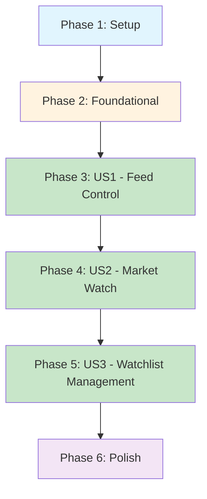

# Implementation Tasks: Mock Market Data & Market Watch

**Feature**: 002-mock-market-data  
**Branch**: `002-mock-market-data`  
**Date**: 2025-11-13  
**Status**: Ready for implementation

---

## Overview

This document provides a dependency-ordered, executable task list for implementing the Mock Market Data & Market Watch feature. Tasks are organized by user story to enable independent implementation and testing.

**Implementation Strategy**: Incremental delivery per user story priority (P1 → P2 → P3), with each story representing a complete, independently testable increment.

---

## User Stories Summary

From `spec.md`:

| Story   | Priority | Description                                | Independent Test                                             | Phase   |
| ------- | -------- | ------------------------------------------ | ------------------------------------------------------------ | ------- |
| **US1** | P1       | Exchange Operator Activates Simulated Feed | ✅ Yes - operator can toggle feed without trader interaction | Phase 3 |
| **US2** | P2       | Trader Monitors Live Watchlist Prices      | ✅ Yes - trader can view Market Watch independently          | Phase 4 |
| **US3** | P3       | Trader Manages Watchlist Membership        | ✅ Yes - trader can add/remove instruments independently     | Phase 5 |

**MVP Scope**: User Story 1 (US1) provides core value - operators can control the simulated market data feed.

---

## Dependencies & Execution Order



**Key Dependencies**:

- Foundation phase MUST complete before any user stories
- US2 depends on US1 (needs feed running to display quotes)
- US3 is independent of US1 but builds on US2 (needs Market Watch UI)

**Parallel Opportunities**:

- Within each phase, tasks marked `[P]` can run in parallel
- US1 backend and US2 frontend preparation can overlap
- US3 backend and frontend can be developed in parallel

---

## Phase 1: Setup & Project Initialization

**Goal**: Prepare development environment and verify baseline M0 dependencies.

**Prerequisites**: M0 baseline seed data loaded (Instrument, Exchange, MarketHoliday, Watchlist entities).

### Tasks

- [ ] T001 Verify M0 baseline seed data is loaded (run `./mvnw spring-boot:run -Dspring-boot.run.profiles=dev,seed` and check logs for "Baseline seed completed successfully")
- [ ] T002 Verify PostgreSQL database connectivity and M0 schema (`psql -h localhost -U rnexchange -d rnexchange -c "\dt"` should show instrument, exchange, market_holiday, watchlist tables)
- [ ] T003 Verify JHipster 8.x application runs successfully (`./mvnw spring-boot:run` and check port 8080 accessible)
- [ ] T004 Verify frontend build tools (`npm install` and `npm run webapp:build:dev` complete without errors)
- [ ] T005 Create feature branch structure in `specs/002-mock-market-data/` (verify plan.md, research.md, data-model.md, contracts/, quickstart.md exist)
- [ ] T006 Review constitution compliance from plan.md (confirm all 7 principles marked as PASS)
- [ ] T007 Review technical context from plan.md (Java 21, Spring Boot 3.x, React 18, WebSocket/STOMP stack)

**Completion Criteria**: All baseline infrastructure verified, development environment ready, planning artifacts reviewed.

---

## Phase 2: Foundational Components

**Goal**: Implement shared infrastructure that blocks all user stories (DTOs, state models, core services).

**Why Foundational**: These components are dependencies for US1, US2, and US3. Must complete before any user story implementation.

### DTOs & State Models

- [ ] T008 [P] Create `QuoteDTO` record in `src/main/java/com/rnexchange/service/dto/QuoteDTO.java` (immutable record with symbol, lastPrice, open, change, changePercent, volume, timestamp fields per data-model.md)
- [ ] T009 [P] Create `BarDTO` record in `src/main/java/com/rnexchange/service/dto/BarDTO.java` (immutable record with symbol, open, high, low, close, volume, timestamp fields per data-model.md)
- [ ] T010 [P] Create `FeedStatusDTO` record in `src/main/java/com/rnexchange/service/dto/FeedStatusDTO.java` (globalState, startedAt, exchanges list per data-model.md)
- [ ] T011 [P] Create `ExchangeStatusDTO` record nested in FeedStatusDTO (exchangeCode, state, lastTickTime, ticksPerSecond, activeInstruments per data-model.md)
- [ ] T012 [P] Create `FeedState` enum in `src/main/java/com/rnexchange/service/dto/FeedState.java` (values: RUNNING, STOPPED, HOLIDAY)
- [ ] T013 [P] Create `InstrumentState` class in `src/main/java/com/rnexchange/service/marketdata/InstrumentState.java` (mutable state holder with synchronized updateWithTick method per data-model.md)

### Price Generation Logic

- [ ] T014 Create `PriceGenerator` class in `src/main/java/com/rnexchange/service/marketdata/PriceGenerator.java` (implements Geometric Brownian Motion with bounds per research.md)
- [ ] T015 Write unit test `PriceGeneratorTest` in `src/test/java/com/rnexchange/service/marketdata/PriceGeneratorTest.java` (test price bounds, volatility, random walk behavior per quickstart.md example)
- [ ] T016 Implement `PriceGenerator.nextPrice()` method to pass unit tests (apply GBM formula, enforce min/max bounds, round to 2 decimals per research.md)

### Bar Aggregation Logic

- [ ] T017 Create `BarAggregator` class in `src/main/java/com/rnexchange/service/marketdata/BarAggregator.java` (session-level OHLC aggregation per research.md)
- [ ] T018 Implement `BarAggregator.createBar()` method (generates BarDTO from InstrumentState per data-model.md)

### WebSocket Configuration

- [ ] T019 Extend `WebSocketConfig` in `src/main/java/com/rnexchange/config/WebSocketConfig.java` (enable STOMP broker for /topic destinations, register /ws endpoint with SockJS per research.md)
- [ ] T020 Create `MarketDataWebSocketHandler` service in `src/main/java/com/rnexchange/web/websocket/MarketDataWebSocketHandler.java` (inject SimpMessagingTemplate, implement broadcastQuote() and broadcastBar() methods per quickstart.md)

**Completion Criteria**: All DTOs, state models, core algorithms (price generation, OHLC aggregation), and WebSocket infrastructure implemented and unit tested.

---

## Phase 3: User Story 1 - Exchange Operator Activates Simulated Feed (P1)

**Story Goal**: Exchange operator can start/stop the simulated market data feed and view status via REST API.

**Independent Test**: Can be fully tested by logging in as `exchange_op`, calling start/stop/status endpoints, and observing state transitions without needing trader interaction.

**Acceptance Criteria** (from spec.md):

1. Given feed is stopped, When operator issues start command, Then system reports running within 2s and records activation timestamp
2. Given feed is running, When operator issues stop command, Then system halts price generation, updates status to stopped, preserves last tick time

### Backend: Mock Market Data Service

- [ ] T021 [US1] Create `MockMarketDataService` class in `src/main/java/com/rnexchange/service/marketdata/MockMarketDataService.java` (singleton service with volatile FeedState, ScheduledFuture for tick job, Map<String, InstrumentState> per research.md)
- [ ] T022 [US1] Implement `MockMarketDataService.start()` method (load active instruments from repository, initialize InstrumentState map, start scheduled executor at 750ms interval, set state to RUNNING, log activation per research.md)
- [ ] T023 [US1] Implement `MockMarketDataService.stop()` method (cancel scheduled task, set state to STOPPED, log deactivation per research.md)
- [ ] T024 [US1] Implement `MockMarketDataService.getStatus()` method (aggregate FeedStatusDTO with per-exchange metrics from InstrumentState map per data-model.md)
- [ ] T025 [US1] Implement `MockMarketDataService.generateTicks()` method (query MarketHoliday for closed exchanges, filter instruments, apply PriceGenerator, update InstrumentState, broadcast QuoteDTO via WebSocketHandler per research.md)
- [ ] T026 [US1] Add `@PostConstruct` method to auto-start feed on application launch (FR-013 requirement per spec.md)
- [ ] T027 [US1] Add `@PreDestroy` method to gracefully stop feed on shutdown per research.md best practices

### Backend: REST Endpoints for Operator Control

- [ ] T028 [US1] Copy `contracts/mock-market-data.openapi.yaml` to `src/main/resources/swagger/api.yml` (merge with existing api.yml if present)
- [ ] T029 [US1] Run code generation (`./mvnw generate-sources`) to generate `MarketDataControlApiDelegate` interface
- [ ] T030 [US1] Create `MarketDataControlApiDelegateImpl` in `src/main/java/com/rnexchange/web/rest/delegate/MarketDataControlApiDelegateImpl.java` (inject MockMarketDataService)
- [ ] T031 [US1] Implement `startMockFeed()` method with `@PreAuthorize("hasAuthority('EXCHANGE_OPERATOR')")` (call service.start(), return status per quickstart.md)
- [ ] T032 [US1] Implement `stopMockFeed()` method with `@PreAuthorize("hasAuthority('EXCHANGE_OPERATOR')")` (call service.stop(), return status per quickstart.md)
- [ ] T033 [US1] Implement `getMockFeedStatus()` method with `@PreAuthorize("hasAuthority('EXCHANGE_OPERATOR')")` (return service.getStatus() per quickstart.md)

### Backend: Integration Tests

- [ ] T034 [US1] Write `MockMarketDataServiceIT` in `src/test/java/com/rnexchange/service/marketdata/MockMarketDataServiceIT.java` (test start, stop, idempotency, status per quickstart.md examples)
- [ ] T035 [US1] Write `MarketDataResourceIT` in `src/test/java/com/rnexchange/web/rest/MarketDataResourceIT.java` (test REST endpoints with @WithMockUser EXCHANGE_OPERATOR, verify RBAC per quickstart.md examples)
- [ ] T036 [US1] Write `MarketDataWebSocketIT` in `src/test/java/com/rnexchange/web/websocket/MarketDataWebSocketIT.java` (test quote broadcast over WebSocket per quickstart.md example)

### Frontend: Exchange Console Panel (Optional for MVP)

- [ ] T037 [P] [US1] Create `MarketDataPanel` component in `src/main/webapp/app/modules/exchange-console/market-data-panel.tsx` (display feed status, last tick time, ticks/sec per exchange per quickstart.md)
- [ ] T038 [P] [US1] Add start/stop buttons to MarketDataPanel (call POST /api/marketdata/mock/start and /stop endpoints per contracts)
- [ ] T039 [P] [US1] Implement status polling in MarketDataPanel (GET /api/marketdata/mock/status every 2s, display in table per quickstart.md)

### Validation

- [ ] T040 [US1] Manual test: Login as `exchange_op`, call POST /api/marketdata/mock/start via curl/Postman, verify response shows globalState=RUNNING
- [ ] T041 [US1] Manual test: Check application logs for "Mock feed started automatically" on startup (FR-013)
- [ ] T042 [US1] Manual test: Call POST /api/marketdata/mock/stop, verify globalState=STOPPED within 2s
- [ ] T043 [US1] Manual test: Verify idempotency (multiple start calls return success without error)
- [ ] T044 [US1] Run all backend integration tests (`./mvnw verify -Dtest=MockMarketDataServiceIT,MarketDataResourceIT,MarketDataWebSocketIT`)

**US1 Completion Criteria**: Exchange operator can start/stop feed via REST API, status updates within 2s, feed auto-starts on launch, all integration tests pass. US1 is independently deployable and testable.

---

## Phase 4: User Story 2 - Trader Monitors Live Watchlist Prices (P2)

**Story Goal**: Trader can view live last-traded prices, percent change, volume, and last update time for instruments in their watchlist via Market Watch screen.

**Independent Test**: Can be fully tested by logging in as `trader1`, opening Market Watch, and verifying watchlist instruments update in real-time with accurate calculations and status cues.

**Dependencies**: Requires US1 (feed must be running to generate quotes).

**Acceptance Criteria** (from spec.md):

1. Given feed is running, When trader opens Market Watch and selects watchlist, Then each instrument displays LTP, percent change, volume, last update time refreshing automatically
2. Given WebSocket connection drops, When client attempts reconnection, Then status indicator shows "Reconnecting/Disconnected" until successful reconnect

### Frontend: WebSocket Service

- [ ] T045 [P] [US2] Create TypeScript model `IQuote` in `src/main/webapp/app/shared/model/quote.model.ts` (symbol, lastPrice, open, change, changePercent, volume, timestamp fields per contracts/websocket-topics.md)
- [ ] T046 [P] [US2] Create TypeScript model `IBar` in `src/main/webapp/app/shared/model/bar.model.ts` (symbol, open, high, low, close, volume, timestamp per contracts/websocket-topics.md)
- [ ] T047 [US2] Create `MarketDataWebSocketService` class in `src/main/webapp/app/modules/market-watch/websocket-service.ts` (wrap @stomp/stompjs Client, implement connect/subscribe/unsubscribe/disconnect per contracts/websocket-topics.md example)
- [ ] T048 [US2] Implement JWT token extraction in WebSocketService (get token from Storage.local or Storage.session per quickstart.md example)
- [ ] T049 [US2] Implement reconnection logic with exponential backoff (reconnectDelay: 5000, heartbeat: 10000 per contracts/websocket-topics.md)
- [ ] T050 [US2] Implement subscription management (Map<symbol, subscription> to track active subscriptions per contracts/websocket-topics.md)

### Frontend: Redux State Management

- [ ] T051 [P] [US2] Create `market-watch.reducer.ts` in `src/main/webapp/app/modules/market-watch/market-watch.reducer.ts` (Redux Toolkit slice with quotes state, connectionStatus, updateQuote/setConnectionStatus/clearQuotes actions per quickstart.md example)
- [ ] T052 [P] [US2] Register marketWatch reducer in `src/main/webapp/app/config/store.ts` (add to rootReducer per quickstart.md)

### Frontend: React Hook for Subscriptions

- [ ] T053 [US2] Create `useMarketDataSubscription` hook in `src/main/webapp/app/modules/market-watch/use-market-data-subscription.ts` (custom hook wrapping WebSocketService with auto-lifecycle, returns ConnectionStatus per contracts/websocket-topics.md example)
- [ ] T054 [US2] Implement useEffect for connection lifecycle (activate client, subscribe to symbols, cleanup on unmount per contracts/websocket-topics.md)
- [ ] T055 [US2] Implement symbol change detection (re-subscribe when symbols array changes per contracts/websocket-topics.md)

### Frontend: Market Watch Component

- [ ] T056 [US2] Create `market-watch.tsx` component in `src/main/webapp/app/modules/market-watch/market-watch.tsx` (main Market Watch screen per quickstart.md example)
- [ ] T057 [US2] Implement watchlist selector dropdown (load trader's watchlists from existing API, display in dropdown)
- [ ] T058 [US2] Implement quote table (columns: Symbol, LTP, Change, Change %, Volume, Last Updated per spec.md FR-009)
- [ ] T059 [US2] Implement row color coding (green for positive change, red for negative, gray for neutral per spec.md FR-010)
- [ ] T060 [US2] Add "SIMULATED FEED" badge at top of Market Watch (persistent badge per spec.md FR-010)
- [ ] T061 [US2] Add WebSocket connection status indicator (Connected/Reconnecting/Disconnected badge per spec.md FR-010)
- [ ] T062 [US2] Integrate useMarketDataSubscription hook (subscribe to watchlist symbols, dispatch updateQuote on message per quickstart.md)
- [ ] T063 [US2] Implement client-side throttling (throttle Redux dispatch to 200ms per quote per research.md best practices)
- [ ] T064 [US2] Create `market-watch.scss` styling in `src/main/webapp/app/modules/market-watch/market-watch.scss` (table styling, color classes, badges)

### Frontend: Routing & Navigation

- [ ] T065 [US2] Add Market Watch route in `src/main/webapp/app/routes.tsx` (PrivateRoute path="/market-watch" hasAnyAuthorities={[AUTHORITIES.TRADER]} per quickstart.md)
- [ ] T066 [US2] Add Market Watch navigation link in trader menu (visible only to TRADER role)

### Frontend: Component Tests

- [ ] T067 [P] [US2] Write `market-watch.spec.tsx` in `src/test/javascript/spec/app/modules/market-watch/market-watch.spec.tsx` (test component rendering, quote updates, color coding per quickstart.md)
- [ ] T068 [P] [US2] Write `market-watch.reducer.spec.ts` for Redux reducer tests (test updateQuote, setConnectionStatus, clearQuotes actions)

### Backend: Bar Broadcasting (60-second intervals)

- [ ] T069 [US2] Implement scheduled bar broadcasting in MockMarketDataService (create BarDTO from InstrumentState every 60s, broadcast via WebSocketHandler to /topic/bars/{symbol} per research.md)

### Validation

- [ ] T070 [US2] Manual test: Login as `trader1`, navigate to /market-watch, verify "SIMULATED FEED" badge visible
- [ ] T071 [US2] Manual test: Verify connection status shows "CONNECTED" when WebSocket active
- [ ] T072 [US2] Manual test: Select watchlist, verify instruments display with LTP, Change %, Volume columns
- [ ] T073 [US2] Manual test: Verify prices update automatically every ~1 second (check Last Updated column)
- [ ] T074 [US2] Manual test: Verify color coding (green for positive change, red for negative)
- [ ] T075 [US2] Manual test: Disconnect network, verify status shows "DISCONNECTED", reconnect and verify recovery
- [ ] T076 [US2] Run frontend tests (`npm test -- market-watch.spec.tsx`)

**US2 Completion Criteria**: Trader can view Market Watch with live updating prices, WebSocket connection status indicator works, color coding applies, all component tests pass. US2 is independently testable (requires US1 feed running).

---

## Phase 5: User Story 3 - Trader Manages Watchlist Membership (P3)

**Story Goal**: Trader can add or remove instruments from a chosen watchlist and immediately see the table adjust with new instruments receiving live updates.

**Independent Test**: Can be fully tested by performing REST add/remove actions on a watchlist while monitoring the table to confirm instruments appear/disappear and receive updates promptly.

**Dependencies**: Builds on US2 (needs Market Watch UI).

**Acceptance Criteria** (from spec.md):

1. Given trader selects watchlist, When they add eligible instrument, Then instrument appears in table within 2s and begins displaying simulated quotes
2. Given trader viewing watchlist entry, When they remove instrument, Then it disappears from table and no longer receives live updates

### Backend: Watchlist API Extensions

- [ ] T077 [P] [US3] Create `WatchlistDTO` record in `src/main/java/com/rnexchange/service/dto/WatchlistDTO.java` (id, name, items list per data-model.md)
- [ ] T078 [P] [US3] Create `WatchlistItemDTO` record in `src/main/java/com/rnexchange/service/dto/WatchlistItemDTO.java` (symbol, sortOrder per data-model.md)
- [ ] T079 [P] [US3] Create `AddWatchlistItemRequest` record in `src/main/java/com/rnexchange/web/rest/dto/AddWatchlistItemRequest.java` (@NotBlank String symbol per data-model.md)
- [ ] T080 [US3] Update `contracts/mock-market-data.openapi.yaml` with watchlist endpoints (POST /api/watchlists/{id}/items, DELETE /api/watchlists/{id}/items/{symbol}, GET /api/watchlists/{id} per contracts)
- [ ] T081 [US3] Run code generation (`./mvnw generate-sources`) to generate `WatchlistManagementApiDelegate` interface
- [ ] T082 [US3] Create `WatchlistManagementApiDelegateImpl` in `src/main/java/com/rnexchange/web/rest/delegate/WatchlistManagementApiDelegateImpl.java` (inject WatchlistRepository, InstrumentRepository, WatchlistMapper)

### Backend: Add Item Implementation

- [ ] T083 [US3] Implement `addWatchlistItem()` method with `@PreAuthorize("hasAuthority('TRADER')")` (verify ownership, check symbol exists, check for duplicates, add item, return updated watchlist per quickstart.md example)
- [ ] T084 [US3] Add ownership validation (compare watchlist.trader.user.login to SecurityUtils.getCurrentUserLogin(), return 403 if mismatch per research.md)
- [ ] T085 [US3] Add instrument existence check (query InstrumentRepository.findBySymbol(), return 400 if not found per quickstart.md)
- [ ] T086 [US3] Add duplicate check (stream watchlist items, return 400 if symbol already present per quickstart.md)

### Backend: Remove Item Implementation

- [ ] T087 [US3] Implement `removeWatchlistItem()` method with `@PreAuthorize("hasAuthority('TRADER')")` (verify ownership, find item by symbol, remove from watchlist, return updated watchlist per contracts)
- [ ] T088 [US3] Add symbol-in-watchlist check (return 404 if symbol not in watchlist per contracts)

### Backend: Get Watchlist Implementation

- [ ] T089 [US3] Implement `getWatchlist()` method with `@PreAuthorize("hasAuthority('TRADER')")` (verify ownership, return WatchlistDTO per contracts)

### Backend: Integration Tests

- [ ] T090 [P] [US3] Write `WatchlistResourceIT` in `src/test/java/com/rnexchange/web/rest/WatchlistResourceIT.java` (test add item, remove item, ownership validation, duplicate rejection per quickstart.md example)

### Frontend: Watchlist Management UI

- [ ] T091 [P] [US3] Create `WatchlistSelector` component in `src/main/webapp/app/modules/market-watch/watchlist-selector.tsx` (dropdown to select watchlist, displays name and item count)
- [ ] T092 [US3] Add "Add Symbol" button/modal to Market Watch (input for symbol, validation, POST to /api/watchlists/{id}/items per contracts)
- [ ] T093 [US3] Add "Remove" action to each watchlist row (delete icon/button, DELETE to /api/watchlists/{id}/items/{symbol} per contracts)
- [ ] T094 [US3] Implement optimistic UI updates (update Redux state immediately, revert on error)
- [ ] T095 [US3] Update useMarketDataSubscription to handle symbol changes (unsubscribe from removed symbols, subscribe to added symbols per contracts/websocket-topics.md)
- [ ] T096 [US3] Add error handling for add/remove operations (display toast/alert on validation errors per contracts error responses)

### Frontend: API Integration

- [ ] T097 [P] [US3] Create watchlist API service in `src/main/webapp/app/shared/api/watchlist.api.ts` (functions for addItem, removeItem, getWatchlist wrapping axios calls per contracts)

### Frontend: Component Tests

- [ ] T098 [P] [US3] Write `watchlist-selector.spec.tsx` for WatchlistSelector component tests (test selection, display)
- [ ] T099 [P] [US3] Update `market-watch.spec.tsx` to test add/remove functionality (mock API calls, verify symbol appears/disappears)

### Validation

- [ ] T100 [US3] Manual test: Login as `trader1`, open Market Watch, click "Add Symbol", enter "INFY", verify appears in table within 2s
- [ ] T101 [US3] Manual test: Verify INFY starts receiving live quote updates (LTP changes)
- [ ] T102 [US3] Manual test: Click remove icon on INFY row, verify disappears from table
- [ ] T103 [US3] Manual test: Verify INFY no longer receives updates (WebSocket unsubscribed)
- [ ] T104 [US3] Manual test: Try adding duplicate symbol, verify error message displays
- [ ] T105 [US3] Manual test: Try adding invalid symbol, verify "Symbol not found" error
- [ ] T106 [US3] Manual test: Try adding symbol to another trader's watchlist, verify 403 Forbidden
- [ ] T107 [US3] Run backend integration tests (`./mvnw verify -Dtest=WatchlistResourceIT`)
- [ ] T108 [US3] Run frontend tests (`npm test -- watchlist-selector.spec.tsx`)

**US3 Completion Criteria**: Trader can add/remove instruments from watchlist, table updates within 3s, WebSocket subscriptions adjust dynamically, all validation and tests pass. US3 is independently testable.

---

## Phase 6: Polish & Cross-Cutting Concerns

**Goal**: Address edge cases, performance optimization, documentation, and deployment readiness.

### Edge Cases & Holiday Handling

- [ ] T109 [P] Implement holiday filtering in MockMarketDataService.generateTicks() (query MarketHoliday table, filter out closed exchanges per research.md implementation)
- [ ] T110 [P] Implement trading hours check (isWithinTradingHours method comparing LocalTime per research.md)
- [ ] T111 [P] Add "Closed/Holiday" badge display in Market Watch UI (show badge for instruments whose exchange is on holiday per spec.md FR-014)
- [ ] T112 [P] Test holiday scenario: Insert test MarketHoliday record for NSE today, restart feed, verify NSE instruments stop ticking

### Performance Optimization

- [ ] T113 [P] Implement batch broadcasting in MockMarketDataService (queue quotes, flush every 100ms with deduplication per research.md Section 6.1)
- [ ] T114 [P] Configure Spring task executor thread pools in `application.yml` (scheduling pool size=8, execution pool size=16 per research.md Section 6.2)
- [ ] T115 [P] Implement client-side throttling in Market Watch (throttle updateQuote dispatch to 200ms per research.md Section 6.3)
- [ ] T116 [P] Add subscription limit validation (max 50 symbols per client, return ERROR frame if exceeded per contracts/websocket-topics.md)

### Stale Data Detection

- [ ] T117 [P] Implement stale data indicator in Market Watch (track lastMessageTime per symbol, show "Stale" if no message for 10s per contracts/websocket-topics.md)

### Audit Logging

- [ ] T118 [P] Add audit logging for operator start/stop actions (log to TraderAuditLog with user ID, role, action, timestamp per research.md best practices)

### Error Handling

- [ ] T119 [P] Implement WebSocket error handling in frontend (onStompError handler, token refresh on Unauthorized per contracts/websocket-topics.md)
- [ ] T120 [P] Add graceful degradation for broadcast failures (log error, continue broadcasting to other subscribers per research.md best practices)

### E2E Tests

- [ ] T121 Write Cypress E2E test for Market Watch (`cypress/e2e/market-watch.cy.ts` per quickstart.md example: login as trader1, verify quotes display, test add/remove)
- [ ] T122 Write Cypress E2E test for Exchange Operator console (`cypress/e2e/exchange-console.cy.ts`: login as exchange_op, start/stop feed, verify status)

### Performance Testing

- [ ] T123 Create Gatling load test scenario (`src/test/gatling/MarketWatchSimulation.scala` per quickstart.md: 1,000 traders subscribing to 10 symbols each)
- [ ] T124 Run Gatling test and verify success criteria (p95 latency <500ms, <0.1% message loss, <4GB heap per research.md)

### Documentation

- [ ] T125 [P] Update main README.md with Market Watch feature section (add navigation instructions, screenshots)
- [ ] T126 [P] Document environment variables/configuration in README (volatility factors, tick intervals, thread pool sizes)
- [ ] T127 [P] Add troubleshooting section to quickstart.md (based on manual testing findings)

### Code Quality

- [ ] T128 Run ESLint on frontend code (`npm run lint` and fix any errors)
- [ ] T129 Run Checkstyle on backend code (`./mvnw checkstyle:check` and fix violations)
- [ ] T130 Run SonarQube analysis (`./mvnw sonar:sonar` and address P1 issues)
- [ ] T131 Verify test coverage targets (90%+ backend via JaCoCo, 80%+ frontend via Jest coverage report)

### Deployment Preparation

- [ ] T132 Test application startup with feed auto-start (`./mvnw spring-boot:run`, verify "Mock feed started automatically" in logs)
- [ ] T133 Test graceful shutdown (Ctrl+C, verify feed stops cleanly with "Mock feed stopped" log)
- [ ] T134 Verify Docker Compose setup (optional: test with `docker-compose -f src/main/docker/app.yml up`)

### Final Validation

- [ ] T135 Run full test suite (`./mvnw verify && npm test`)
- [ ] T136 Manual regression test: All acceptance scenarios from spec.md (US1, US2, US3)
- [ ] T137 Performance validation: Run Gatling scenario, confirm targets met
- [ ] T138 Security validation: Verify RBAC on all endpoints (try accessing operator endpoints as trader, expect 403)
- [ ] T139 Cross-browser test: Verify Market Watch works in Chrome, Firefox, Safari
- [ ] T140 Mobile responsive test: Check Market Watch layout on mobile viewport (optional)

**Phase 6 Completion Criteria**: All edge cases handled, performance optimized, E2E tests pass, code quality checks pass, documentation updated, deployment-ready.

---

## Summary & Metrics

### Task Breakdown

| Phase                               | Task Count | Parallelizable | Story         |
| ----------------------------------- | ---------- | -------------- | ------------- |
| Phase 1: Setup                      | 7          | 0              | N/A           |
| Phase 2: Foundational               | 13         | 9              | N/A           |
| Phase 3: US1 - Feed Control         | 24         | 4              | US1 (P1)      |
| Phase 4: US2 - Market Watch         | 32         | 10             | US2 (P2)      |
| Phase 5: US3 - Watchlist Management | 32         | 11             | US3 (P3)      |
| Phase 6: Polish                     | 32         | 18             | Cross-cutting |
| **Total**                           | **140**    | **52**         | **3 stories** |

### Parallel Execution Opportunities

**Within Phase 2 (Foundational)**:

- T008-T013 (DTOs/enums) can all run in parallel (different files)

**Within Phase 3 (US1)**:

- T037-T039 (frontend console panel) can run in parallel with T034-T036 (backend tests)

**Within Phase 4 (US2)**:

- T045-T046 (TypeScript models), T051-T052 (Redux), T067-T068 (tests) can run in parallel

**Within Phase 5 (US3)**:

- T077-T079 (DTOs), T090 (test), T091 (UI component), T097 (API service), T098-T099 (tests) can run in parallel

**Within Phase 6 (Polish)**:

- T109-T120 (edge cases/optimization), T125-T127 (documentation) can run in parallel

### MVP Scope Recommendation

**Minimum Viable Product**: Complete through Phase 3 (US1) only.

**Rationale**: US1 provides core value - operators can control the simulated feed, quotes are generated and broadcast over WebSocket. This is independently deployable and testable. US2 and US3 add UI convenience but aren't blocking for feed functionality.

**Incremental Rollout**:

1. **Sprint 1**: Phase 1-3 (Setup + Foundation + US1) → Deploy to staging, validate feed control
2. **Sprint 2**: Phase 4 (US2) → Add Market Watch UI, validate trader experience
3. **Sprint 3**: Phase 5 (US3) → Add watchlist management, full feature complete
4. **Sprint 4**: Phase 6 (Polish) → Performance tuning, E2E tests, production deploy

### Independent Testing Per Story

| Story   | Test Without Others     | Test Data Needed                   | Test User     |
| ------- | ----------------------- | ---------------------------------- | ------------- |
| **US1** | ✅ Yes                  | M0 baseline (Instrument, Exchange) | `exchange_op` |
| **US2** | ✅ Requires US1 running | M0 baseline + US1 feed active      | `trader1`     |
| **US3** | ✅ Requires US2 UI      | M0 baseline + trader's watchlists  | `trader1`     |

### Constitution Compliance Checklist

Per plan.md Constitution Check:

- [x] **TDD**: Contract tests before implementation (T015, T034-T036, T067-T068, T090, T098-T099, T121-T122)
- [x] **JHipster Conventions**: OpenAPI-first (T028-T029, T080-T081), layered architecture (Service → Resource → Delegate)
- [x] **RBAC**: `@PreAuthorize` on all endpoints (T031-T033, T083, T087, T089)
- [x] **Real-Time Architecture**: WebSocket/STOMP implementation (T019-T020, T047-T050, T069)
- [x] **Educational Transparency**: UI badges (T060-T061, T111)
- [x] **DDD**: Domain services (T021-T027), value objects (T008-T012), business logic in services not controllers
- [x] **API-First**: OpenAPI contracts before code generation (T028, T080)

---

## Execution Instructions

### Quick Start (MVP - US1 Only)

```bash
# 1. Setup phase
git checkout 002-mock-market-data
./mvnw spring-boot:run -Dspring-boot.run.profiles=dev,seed  # Verify M0 baseline

# 2. Foundation phase (T008-T020)
# Implement DTOs, PriceGenerator, BarAggregator, WebSocket config

# 3. US1 phase (T021-T044)
# Implement MockMarketDataService, REST endpoints, integration tests

# 4. Validate US1
./mvnw verify -Dtest=MockMarketDataServiceIT,MarketDataResourceIT
curl -X POST http://localhost:8080/api/marketdata/mock/start \
  -H "Authorization: Bearer $EXCHANGE_OP_TOKEN"

# 5. MVP complete - deploy to staging
```

### Full Feature (All Stories)

```bash
# After US1 validated, continue with US2 (T045-T076)
# Then US3 (T077-T108)
# Then Polish (T109-T140)

# Final validation
./mvnw verify && npm test
npm run e2e
./mvnw gatling:test
```

### Parallel Development Strategy

**Team of 3 developers**:

- **Developer A**: US1 backend (T021-T036)
- **Developer B**: Foundation (T008-T020) → US1 frontend (T037-T039)
- **Developer C**: Tests (T015, T034-T036) → US2 prep (T045-T046, T051-T052)

**After US1 complete**:

- **Developer A**: US2 backend (T069) → US3 backend (T077-T090)
- **Developer B**: US2 frontend (T047-T066)
- **Developer C**: US2 tests (T067-T068) → US3 frontend (T091-T099)

---

## Next Steps

1. **Review this tasks.md** with team, adjust task granularity if needed
2. **Create tracking board** (Jira/Linear/GitHub Projects) from tasks
3. **Assign tasks** per parallel execution strategy above
4. **Set up CI/CD** to run tests on each PR (integration tests, lint, coverage)
5. **Begin implementation** starting with Phase 1 (Setup verification)

**Ready to implement!** 🚀 All 140 tasks are executable, dependency-ordered, and independently testable per user story.
